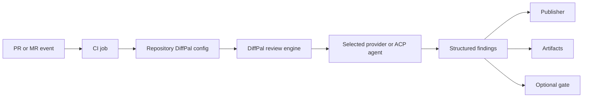

# How DiffPal Works

DiffPal is an open-source pull request and merge request review engine that
runs in your CI workflow. It standardizes how a repository asks an AI provider
for review, validates the response, publishes feedback, writes artifacts, and
optionally blocks a merge.

## Product Boundary

DiffPal owns the review workflow around the provider:

- resolving the requested base/head range and review scope;
- building the review request;
- validating provider output against changed files and lines;
- rendering summaries, findings, and artifacts;
- publishing to supported code hosts;
- applying the configured gate.

DiffPal is not the model, the provider account, or a mandatory hosted review
service.

When a remote provider is configured, DiffPal sends review input to that
provider from the CI job. Use
[Security controls](/security) before enabling secret-backed review.

## Provider Boundary

The selected provider or ACP-compatible CLI owns model reasoning, model access,
provider-specific tools, credentials, sandboxing, and account management.
DiffPal chooses a provider through `diffpal.provider`, sends the review task,
and expects structured review output back.

Use [Providers and agents](/providers-and-agents) for the provider model and
[Providers](/providers) for setup pages.

## Publisher Boundary

DiffPal publishers turn validated findings into host-native feedback. GitHub,
GitLab, and Azure DevOps have native publishers. Custom CI can still produce
local artifacts, and can publish through a supported code host when the job has
the required host metadata and credentials.

Use the [support matrix](/support-matrix) for supported host
outputs.

## Repository-Owned Configuration

DiffPal reads `.config/diffpal/config.yaml` from the repository. That file owns
the selected provider, review settings, platform publishing settings, profiles,
and gate threshold. CI files install/authenticate the provider and pass host
context, but the review policy stays with the repository.

For the first setup path, start with the
[GitHub quickstart](/github-quickstart). For supported
hosts and outputs, see the [support matrix](/support-matrix).
